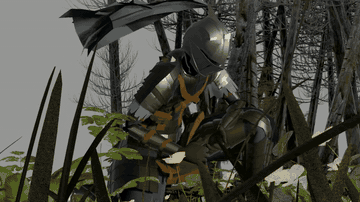
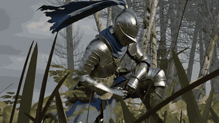
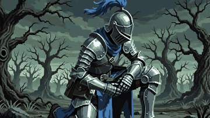

# Nanode AI Render Engine

**Native Gemini image and video workflows for Blender**

[Website](https://nanode.tech) |
[Documentation](https://nanode.tech/docs/#installation) |
[Download](https://github.com/Kovname/nano-banana-render/releases) |
[Pricing](https://nanode.tech/pricing) |
[Issues](https://github.com/Kovname/nano-banana-render/issues)

Nanode turns Blender blockouts, Eevee renders, animation guides, and reference images into finished AI-assisted images and videos. It works as native Blender render engines and editor panels, so generated media stays inside the scene, Render History, Image Editor, and Video Sequencer.

## What's New in 2.8

- **Omni Engine** renders a rough Blender animation into a finished 720p video while preserving camera motion, timing, subject movement, geometry, and composition.
- **Eevee or Workbench source capture** lets you choose between an already-lit Eevee guide and a clean geometry-focused Workbench guide.
- **Style Reference for video** transfers rendering medium, materials, lighting, palette, texture treatment, and color grade without copying objects from the reference.
- **Nanode Video** adds a dedicated Video Sequencer panel for text-to-video, image-to-video, reference images, first/last frames, and video editing.
- **Gemini Omni Flash** supports uploaded-motion editing, automatic source-duration matching, `16:9` and `9:16`, generated audio, and 4/6/8/10 second workflows.
- **Veo 3.1 Lite, Fast, and Standard** are available for explicit video generation at supported 720p, 1080p, and 4K configurations.
- **Continue from Playhead** captures any visible Sequencer frame and uses it as the first frame for a new generation with the currently selected video model.
- **Unified video history** restores results to the current scene, loads video and audio strips, and supports reusing an Omni motion guide without starting a generation.
- **Nano Banana 2 Lite** adds the lowest-cost image model: `gemini-3.1-flash-lite-image`, 1K output, 5 credits.
- **New Google API keys** are supported in Personal API mode, including both `AQ...` and legacy `AIza...` key formats.
- **Safer paid jobs** use unique request IDs, credit reservation, automatic finalization, and refund on API or safety failure.

## Video Examples

Click a preview to open the full video.

<table>
  <tr>
    <th width="33%">1. Eevee Motion Guide</th>
    <th width="33%">2. Omni Render</th>
    <th width="33%">3. Omni + Style Reference</th>
  </tr>
  <tr>
    <td></td>
    <td></td>
    <td></td>
  </tr>
  <tr>
    <td>Original camera, animation, timing, and scene layout rendered with Eevee.</td>
    <td>Finished materials, lighting, shading, reflections, atmosphere, and color grade.</td>
    <td>The same motion and subject identity rendered in the visual language of a reference image.</td>
  </tr>
</table>

## Supported Models

### Image generation

| Nanode name | Google model | Output | Nanode credits |
| --- | --- | ---: | ---: |
| Nano Banana 2 Lite | `gemini-3.1-flash-lite-image` | 1K | 5 |
| Nano Banana 2 | `gemini-3.1-flash-image` | 1K / 2K / 4K | 10 / 15 / 60 |
| Nano Banana Pro | `gemini-3-pro-image` | 1K / 2K / 4K | 30 / 45 / 60 |
| Nano Banana | `gemini-2.5-flash-image` | 1K | 10 |

### Video generation

| Model | Best for | Resolution |
| --- | --- | --- |
| Gemini Omni Flash | Animation rendering, video editing, style-guided video | 720p |
| Veo 3.1 Lite | Lowest-cost standalone video generation | 720p / 1080p |
| Veo 3.1 Fast | Faster production video and higher resolutions | 720p / 1080p / 4K |
| Veo 3.1 Standard | Highest-quality Veo generation | 720p / 1080p / 4K |

Higher-resolution Veo jobs use 8-second output where required by the model.

## Blender Workflows

### Nano Banana Render Engine

- Convert depth/mist passes into finished images while retaining camera and scene geometry.
- Enhance Eevee renders with better materials, lighting, texture detail, and atmosphere.
- Generate 1K, 2K, or 4K output depending on the selected model.
- Apply style references without copying their subjects or composition.
- Browse visual Render History and restore exact generated images.

### Omni Engine

- Capture the active animation using Eevee or Workbench.
- Upload the motion guide as a single video with the selected `16:9` or `9:16` camera.
- Re-render motion, camera, timing, and scene structure with AI-generated shading.
- Add an optional style reference for materials, lighting, palette, and final grade.
- Load successful video and audio directly into the current scene's Sequencer.
- Reuse the original motion guide and prompt from Video History.

### Nanode Video

Available in the Video Sequencer sidebar under `Nanode Video`.

- Generate with Gemini Omni Flash or Veo 3.1.
- Start from text, an image, reference images, or supported first/last frames.
- Select frames directly from Render History or capture the current Sequencer playhead.
- Queue jobs, monitor progress, estimate credits, and restore completed results.
- Continue a generated clip from any visible frame with another supported model.

### AI Video Editor

- Select a Movie Strip, generated result, or local video file.
- Edit with a text prompt while preserving duration, motion, camera path, and identity.
- Match source duration automatically or select a compatible duration manually.
- Apply an optional image as a strict visual-style reference.
- Return the edited clip and its audio to the Video Sequencer.

### Nanode AI Editor

- Perform full-frame image edits from a text prompt.
- Paint masks directly in Blender for inpainting.
- Use Smart Points for precise localized instructions.
- Add reference objects with matched lighting and shadows.
- Browse and restore visual edit history.

### Nanode AI Texturing

- Generate context-aware materials directly on Blender objects.
- Use multi-angle projection cameras for more complete coverage.
- Guide material generation with a style-reference image.

## Documentation

Installation, authentication, render engines, video workflows, model settings, and troubleshooting are maintained in the Nanode documentation.

**[Read the documentation](https://nanode.tech/docs/#installation)**

## Image Examples

### Depth to render

| Depth input | Result |
| :---: | :---: |
|  |  |

### Eevee enhancement

| Eevee draft | Result |
| :---: | :---: |
|  |  |

### Style-guided image rendering

| Eevee draft | Style reference | Result |
| :---: | :---: | :---: |
|  |  |  |

### AI texturing

| Plain object | Textured result |
| :---: | :---: |
|  |  |

### Smart Points

| Target points | Instructions | Result |
| :---: | :---: | :---: |
|  |  |  |

## Credits and Reliability

- New Nanode accounts receive starter credits after Google login.
- Credit cost is shown before image and video generation.
- Video credits are reserved once per unique request.
- Successful jobs finalize the reservation.
- API, moderation, and safety failures automatically refund the reservation.
- Personal Google API mode bypasses Nanode credits.

Current credit packages are listed at [nanode.tech/pricing](https://nanode.tech/pricing).

## Supported by Google Cloud for Startups

  

Nanode is supported by the **Google Cloud for Startups** program. Its cloud credits help us operate the AI infrastructure behind Nanode and continue developing the open-source Blender add-on. Thank you to Google Cloud for supporting independent creators and open-source tools.

## Feedback and Support

- [Open a GitHub issue](https://github.com/Kovname/nano-banana-render/issues)
- Use the in-addon feedback controls
- Email [contact@nanode.tech](mailto:contact@nanode.tech)

## License

Nanode AI Render Engine is open-source software licensed under [GPL-3.0](LICENSE). Google model availability, regional restrictions, pricing, and API behavior are controlled by Google and can change during preview periods.

Built by [Kovname](https://github.com/Kovname)

[Star](https://github.com/Kovname/nano-banana-render) |
[Download](https://github.com/Kovname/nano-banana-render/releases) |
[Website](https://nanode.tech)

